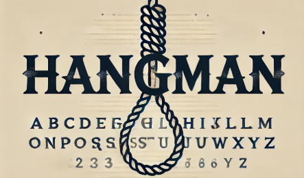

# Консольная игра Hangman



## 📖 Описание

**Консольная игра "Виселица" (Hangman)** — это классическая настольная игра, в которой игрок должен угадать слово, загаданное компьютером. Игрок поочередно вводит буквы. Если буква есть в слове, она открывается. Если нет — начисляется штрафное очко.

### 🎯 Цель игры
- Угадать слово до того, как будет нарисован висельник полностью.
- Играется по определенному числу попыток и уровням сложности.

---

## 🛠️ Основные функции

- **Выбор категории слов:**
    - Животные
    - Цвета
    - Страны
    - Фрукты
    - Спорт

- **Выбор уровня сложности:**
    - Легкий
    - Средний
    - Сложный

- **Подсказки**:
    - Если после 6 неудачных попыток игроку предоставляется подсказка.

- **Система подсчета попыток**:
    - Игрок может сделать 8 попыток для угадывания слова.

---

## 📜 Интерфейс и функционал

### Пример интерфейса при запуске игры:

```bash
  _    _                                         
 | |  | |                                        
 | |__| | __ _ _ __   __ _ _ __ ___   __ _ _ __  
 |  __  |/ _` | '_ \ / _` | '_ ` _ \ / _` | '_ \ 
 | |  | | (_| | | | | (_| | | | | | | (_| | | | |
 |_|  |_|\__,_|_| |_|\__, |_| |_| |_|\__,_|_| |_| 
                     __/ |                      
                    |___/                        

Добро пожаловать в игру Виселица! Вот правила:
1. Угадывайте по одной букве за раз.
2. Количество неверных попыток = 8.
3. После 6 попыток появится подсказка.
4. Если вы угадаете слово до того, как висельник будет полностью нарисован, вы победите.
5. Если висельник будет нарисован полностью, вы проиграете.
После выводится меню выбора категории слова и сложности игры.

```bash
Пожалуйста, выберите категорию из доступных:
1. Животные     2. Цвета     3. Страны
4. Фрукты       5. Спорт
Укажите номер категории: 
2

Выберите сложность игры:
1. Легко
2. Средне
3. Тяжело
2

Выбрана категория: Цвета

Выбран уровень сложности: Средне

Игра началась!

 |
 |
 |
 |
 |
 |______


Вы использовали следующие буквы: 
На данный момент слово выглядит вот так: ________

Введите ваше предположение: 

```

